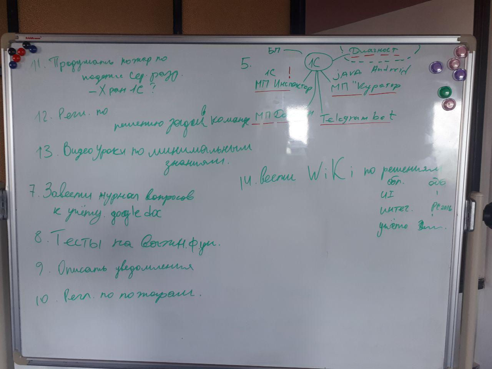

# Протокол встречи 05.02.2019

Участники собрания: Назым, АбдульАзиз

## Приняли решение о следующем:

1. Составить портрет члена команды Н.
2. Изменить регламент спринта А.
3. Составить регламент описания релиза А.
4. Прочитать книгу "Работа мечты" А.
5. Обновить регламент. Применения обновления. Н.
6. Исследовать возможности применения Алисы в приложении Куратора А.
7. Завести журнал вопросов/ответов по учету Доброфона. А.
8. Покрыть тестами важнейший функционал конфы. Все
9. Описать уведомления. Н.
10. Составить регламент по пожарам. Надыр
11. Продумать пожарную ситуацию по среде разработке. Все
12. Составить регламент по решению задач командой. А.
13. Записать видео-уроки по минимальным знаниям. А.
14. Завести ВиКи по решениям команды. А.

